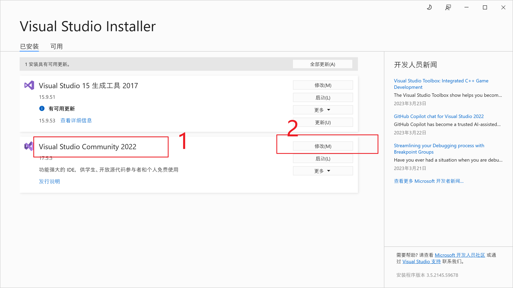

# 安装 electron 运行 dll 环境

## 一、下载安装 Visual Studio 2022

1. 下载地址
   https://visualstudio.microsoft.com/zh-hans/thank-you-downloading-visual-studio/?sku=Community&channel=Release&version=VS2022&source=VSLandingPage&cid=2030&workload=dotnet-dotnetwebcloud&passive=false#dotnet

   上面链接下载的内容 `vs_community__789ff72b1cae4bc0926e0f730fadfa39.exe` 双击它

2. 安装 Visual Studio 2022

   

3. 工作负荷 - 勾选 ✔`Node.js 开发` 和 `使用C++的桌面开发`

   

## 二、安装 Node.js 环境

v14.19.3 https://nodejs.org/dist/v14.19.3/node-v14.19.3-x64.msi

v18.15.0 https://nodejs.org/dist/v18.15.0/node-v18.15.0-x64.msi

点击上面链接安装 Node.js `18.15.0` 版本就可以了，一直下一步就可以

## 三、安装 python 环境

安装 python2.7.15 https://www.python.org/ftp/python/2.7.15/python-2.7.15.amd64.msi

安装 python3.9.12 https://www.python.org/ftp/python/3.9.12/python-3.9.12-amd64.exe

```bash
python --version
Python 3.9.12
```

## 四、全局安装 node-gyp

```bash
npm install node-gyp -g
```

## 五、npm 设置 msbuild_path/msvs_version

```bash
npm config set msvs_version 2022
```

```bash
npm config set msbuild_path "E:\vs2022\MSBuild\Current\Bin\MSBuild.exe"
```

## 六、切换到用户目录并查看`~/npmrc`

```bash
PS C:\Users\Administrator> cat ~/.npmrc
msvs_version=2022
msbuild_path=E:\vs2022\MSBuild\Current\Bin\MSBuild.exe
```

## 七、demodll.dll 生成过程

1. 打开 Visual Studio 2022
2. 新建
3. 项目
4. 动态链接库(DLL) - 下一步
5. 项目名称 demodll - 创建
6. 修改 dllmain.cpp 文件，内容如下 - 保存

dllmain.cpp

```cpp
#include "pch.h"
#include <iostream>

extern "C" __declspec(dllexport) int add(int a, int b)
{
	return a + b;
}

BOOL APIENTRY DllMain(HMODULE hModule, DWORD ul_reason_for_call, LPVOID lpReserved)
{
	switch (ul_reason_for_call)
	{
	case DLL_PROCESS_ATTACH:
	case DLL_THREAD_ATTACH:
	case DLL_THREAD_DETACH:
	case DLL_PROCESS_DETACH:
		break;
	}
	return TRUE;
}


```

7. 顶部菜单 “生成” - “生成解决方案”

```bash
已启动生成...
1>------ 已启动生成: 项目: demodll, 配置: Debug x64 ------
1>pch.cpp
1>dllmain.cpp
1>demodll.vcxproj -> D:\Desktop\mydll\demodll\x64\Debug\demodll.dll
========== 生成: 1 成功，0 失败，0 最新，0 已跳过 ==========
========= 生成 开始于 11:47 AM，并花费了 02.790 秒 ==========
```

`D:\Desktop\mydll\demodll\x64\Debug\demodll.dll` 就是我们的目标文件

## 八、使用 Node.js 调用动态链接库 dll 文件

1. 生成 package.json

```bash
# 创建文件夹demodll
mkdir -p D:\Desktop\mydll\demodll
# 切换至demodll
cd D:\Desktop\mydll\demodll
# 创建一个新的"package.json"文件，使用默认设置
npm init -y
```

2. 安装 ffi 和 ref 模块：

```bash
npm install ffi-napi ref-napi --save
```

3. 把上面生成的 `D:\Desktop\mydll\demodll\x64\Debug\demodll.dll` 拷贝到当前目录下

4. Node.js 代码 index.js 内容如下

```javascript
const ffi = require('ffi-napi');
const ref = require('ref-napi');
const path = require('path');

useAdd();

function useAdd() {
  try {
    // 定义 DLL 文件中的函数类型和参数类型
    // eslint-disable-next-line no-undef
    let dllPath = path.join(__dirname, 'demodll.dll');

    // if (process.env.NODE_ENV !== 'development') {
    //   dllPath = path.join(process.resourcesPath, 'app.asar.unpacked', 'demodll.dll');
    // }

    // 调用dll，并初始化调用的函数add
    // add 返回值 number 类型
    // add 接收两个参数,add(1,2) 参数都是number类型
    const add = ffi.Library(dllPath, {
      add: ['int', ['int', 'int']]
    });

    // 调用函数返回结果
    const result = add.add(2, 3);

    return result;
  } catch (error) {
    console.error(error);
  }
}
```

5. node index.js 就可以调用动态链接库

```bash
node index.js
```

## 九、C 里面的 struct ,我使用 nodejs ffi-napi 调用 dll，我如何传入参数是 struct

在使用 Node.js FFI-NAPI 调用 DLL 时，你可以使用以下步骤传入结构体参数：

首先，在 Node.js 中定义结构体。
例如，如果你需要传入一个包含两个整数的结构体，可以使用以下代码：

```js
const StructType = require('ref-struct-napi');
const int = require('ref-napi').types.int;

const MyStruct = StructType({
  x: int,
  y: int
});
```

这将定义一个名为 MyStruct 的结构体，其中包含两个整数字段 x 和 y。

接下来，你需要将结构体实例化并填充其字段值。
例如，如果你想传入一个 MyStruct 实例，可以使用以下代码：

```js
const myStruct = new MyStruct();
myStruct.x = 10;
myStruct.y = 20;
```

这将创建一个名为 myStruct 的 MyStruct 实例，并将其 x 和 y 字段值分别设置为 10 和 20。

最后，将结构体实例作为参数传递给 DLL 函数。
例如，如果你要调用名为 myDllFunction 的 DLL 函数，并传递 myStruct 作为参数，可以使用以下代码：

```js
const ffi = require('ffi-napi');

const myDll = ffi.Library('myDll', {
  myDllFunction: ['void', [MyStruct]]
});

myDll.myDllFunction(myStruct);
```

这将使用 ffi-napi 库加载名为 myDll 的 DLL，并调用 myDllFunction 函数，并将 myStruct 作为参数传递给它。

请注意，当你传递结构体时，需要确保结构体的布局与 DLL 函数所期望的布局相匹配。如果布局不匹配，则可能导致错误或不可预测的行为。

## 参考地址

https://stackoverflow.com/questions/57879150/how-can-i-solve-error-gypgyp-errerr-find-vsfind-vs-msvs-version-not-set-from-c
